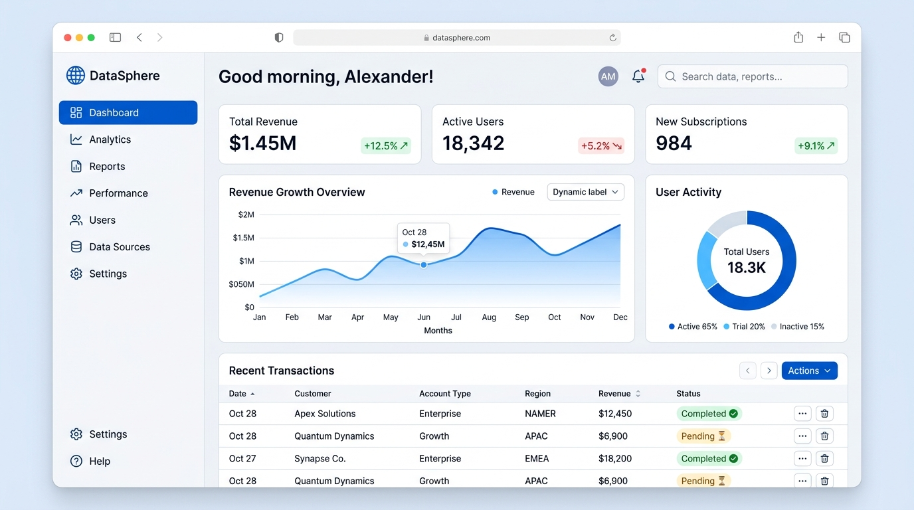

# Enterprise SaaS Hub

## Purpose
Multi-tenant SaaS platform with RBAC and billing.

## Tech Stack
React, TypeScript, Express, PostgreSQL.

## How to Run Locally
1. Install dependencies: npm install
2. Set environment variables (see .env.example)
3. Run dev server: npm run dev

## Architecture
Frontend in React, backend in Node.js/Express. Database is Postgres. Auth via JWT.

## UI Mockup

